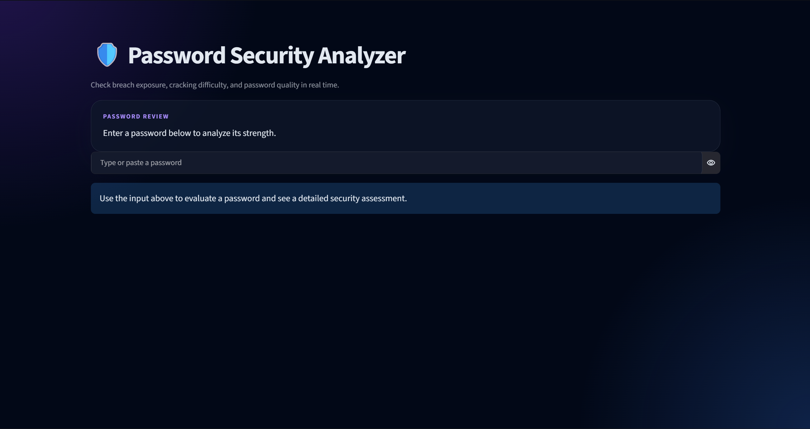
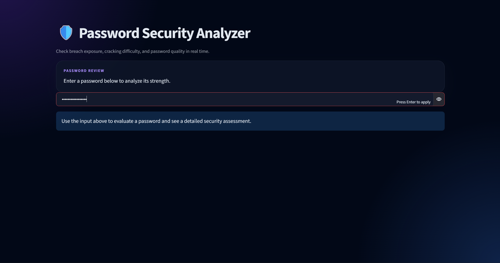
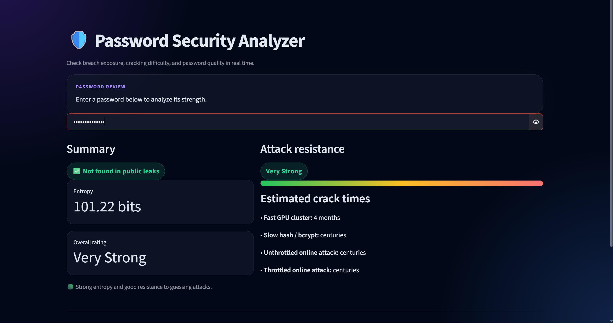

# 🛡️ Password Security Analyzer

A real-time password security evaluation tool built with Python and Streamlit. It combines **k-Anonymity breach verification**, **Dropbox zxcvbn pattern recognition**, and **mathematical entropy scoring** to assess password strength against modern cracking methods.

---

## 📸 Screenshots & Showcase

### 1. Main Interface & Analysis

### 2. Breach Detection & Leaks

### 3. Cracking Resistance & Feedback

---

## ✨ Key Features

* **Zero-Knowledge Data Breach Check:** Verifies whether a password exists in known data breaches via the Have I Been Pwned API using **k-Anonymity SHA-1 prefixing** (plaintext passwords never leave the machine).
* **Cracking Resistance Estimation:** Evaluates pattern strength, spatial keyboard arrangements, and common substitution dictionary hits using Dropbox's `zxcvbn` library.
* **Attack Scenario Breakdown:** Displays estimated cracking time under fast GPU clusters ($10^{10}$ guesses/sec), slow offline hashes (bcrypt/Argon2), unthrottled online attacks, and rate-limited logins.
* **Information Entropy Calculation:** Measures mathematical entropy in bits ($E = L \times \log_2(R)$) based on character set variety and length.
* **Interactive UI:** Built with Streamlit for clean, responsive feedback.

---

## 🛠️ Tech Stack

* **Programming Language:** Python 3.10+
* **Frontend Web Framework:** Streamlit
* **Security & Analysis Libraries:** `zxcvbn`, `hashlib`, `math`
* **Network Communications:** `requests`

---

## 🚀 Getting Started

### Prerequisites

* Python 3.8 or higher installed on your system.

### Installation

1. Clone the repository:
   git clone [https://github.com/Miertie/Password-Security-Analyzer.git]
   cd Password-Security-Analyzer

2. Install dependencies:
   
   pip install -r requirements.txt

3. Run the application:
   python -m streamlit run main.py